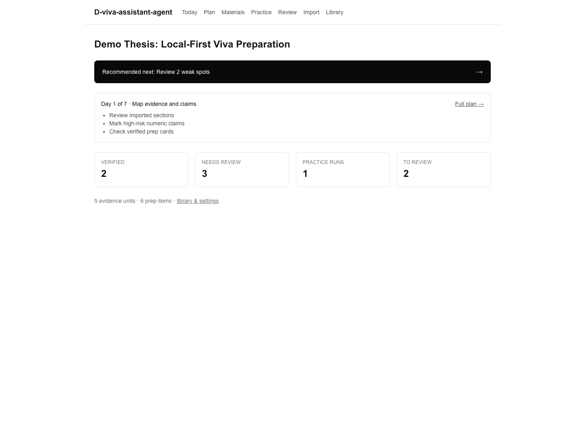
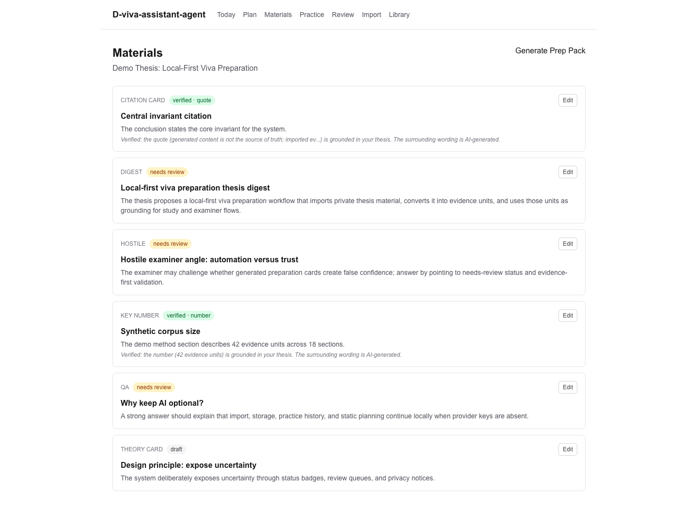
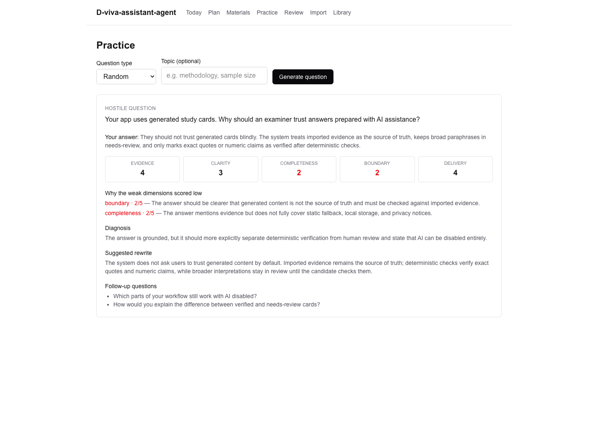
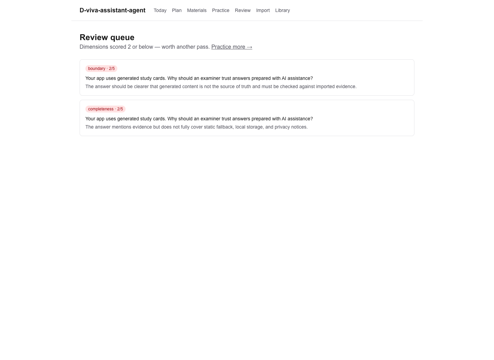
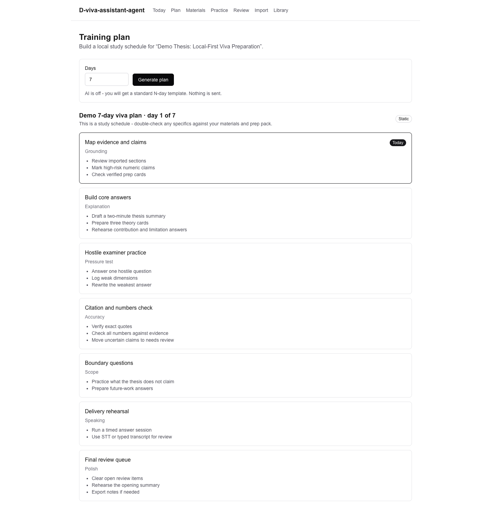
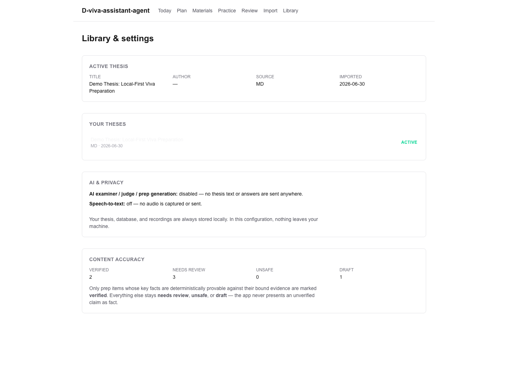
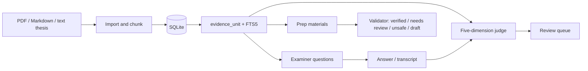

# D-viva-assistant-agent

Local-first thesis viva preparation for any thesis. Import a PDF, Markdown, or plain-text thesis, turn it into evidence units, generate grounded prep materials, practise with an AI examiner, score answers on a five-dimension rubric, and review weak spots without moving private thesis data into a hosted app.

Repository: `handong66/D-viva-assistant-agent`

Last verified from the local repository on 2026-06-30.

## Why This Exists

Viva preparation is high-stakes and usually scattered across notes, prompts, transcripts, and examiner guesses. D-viva-assistant-agent keeps the workflow in one local app:

- imported thesis text becomes the source of truth;
- generated prep material and examiner questions bind back to local evidence units;
- judging separates evidence, clarity, completeness, boundary, and delivery;
- weak dimensions become a review queue for targeted follow-up;
- AI and speech-to-text are optional outbound calls, not required for local import, storage, planning, or review.

## Screenshots

The screenshots below were captured from the actual app running locally with a synthetic demo thesis. They do not contain private user data.

### Daily Dashboard

The home page shows the active thesis, recommended next action, today's plan, and current prep/practice/review counters.



### Evidence-Aware Materials

Prep items carry status badges such as `verified`, `needs review`, and `draft`. Verified key facts show the grounding basis used by the deterministic validator.



### AI Examiner Practice And Judge Output

Practice runs show the examiner question, answer, five-dimension scores, weak-dimension reasons, diagnosis, suggested rewrite, and follow-up questions.



### Review Queue

Scores of 2 or below are saved into an open review queue so revision effort is focused on concrete weaknesses.



### Training Plan

The app can save a local static plan when AI is off, or an AI-generated plan when configured. The dashboard uses the active plan for daily guidance.



### Library, Privacy, And Accuracy

The library page shows thesis switching, AI/STT disclosure text, and content-accuracy counters.



## Current Project Identity

- App/repository display name: `D-viva-assistant-agent`
- npm package name: `d-viva-assistant-agent`
- Electron product name: `D-viva-assistant-agent`
- Electron appId: `com.handong66.dvivaassistantagent`
- Default web/dev database: `./data/d-viva-assistant-agent.sqlite`
- Default Electron database: `<Electron userData>/d-viva-assistant-agent.sqlite`
- GitHub repository: `https://github.com/handong66/D-viva-assistant-agent`

`VIVA_*` environment variable names are intentionally retained for compatibility and because viva is also the thesis-defence domain term. The project identity, package name, Electron name, appId, and default database filename use the new `D-viva-assistant-agent` identity.

## Feature Summary

- **Thesis import:** PDF, Markdown, or plain text import through `/import`; Markdown/plain text are the most reliable paths for poor PDFs.
- **Evidence units:** imported text is chunked into `thesis_chunk` and `evidence_unit` rows; evidence is indexed locally with SQLite FTS5.
- **Dashboard:** `/` shows the active thesis, recommended next action, active training-plan day, prep counts, practice counts, and review counts.
- **Prep materials:** `/materials` lists generated or edited prep cards for digests, key numbers, Q&A, hostile questions, theory cards, and citation cards.
- **Evidence validation:** deterministic checks verify numeric values and exact quotes against bound evidence before a prep item can be marked `verified`.
- **Editable materials:** `/materials/[id]/edit` lets users revise prep items and re-run validation.
- **AI examiner practice:** `/practice` can generate random, cross-section, hostile, and boundary questions, optionally scoped by a topic query through FTS retrieval.
- **Five-dimension judging:** answers are scored on `evidence`, `clarity`, `completeness`, `boundary`, and `delivery`.
- **Review queue:** `/review` stores low-scoring dimensions with the question and reason for targeted re-practice.
- **Training plans:** `/plan` saves AI-generated plans when AI is ready and static local N-day plans when AI is disabled or unavailable.
- **Library and settings:** `/library` switches active theses and shows AI/STT privacy disclosures plus content-accuracy counters.
- **Speech-to-text:** typed answers, browser speech recognition, and Google Cloud Speech-to-Text are supported behind `STT_PROVIDER`.
- **Desktop app:** `npm run electron:pack` builds an unsigned macOS `.app` wrapper that starts the packaged Next server locally.

The app is still a local single-user tool. There are no accounts, hosted sync, multi-user permissions, cloud persistence, or production deployment scripts.

## Core Safety Guarantees

### Evidence Binding

Generated content is not the source of truth. The source of truth is the imported thesis text stored as `evidence_unit` rows.

- Prep items bind to evidence through `prep_item_evidence`.
- Practice questions bind to evidence through `practice_run_evidence`.
- Judge and examiner logic must use bound evidence, not model prior knowledge.
- Numeric values and exact quotes must appear in bound evidence before deterministic validation can mark an item `verified`.
- Broad paraphrases stay `needs_review` unless they can be deterministically proven.

### Local-First Privacy Boundary

By default, local app data stays on the machine:

- SQLite database: `./data/d-viva-assistant-agent.sqlite`
- Recordings: `./recordings`
- Electron data: `<Electron userData>/d-viva-assistant-agent.sqlite` and `<Electron userData>/recordings`

These are ignored by git: `.env*`, `data/`, `recordings/`, SQLite files, and Electron build output.

Optional outbound calls happen only when configured and triggered:

- Prep-pack generation sends the thesis title and selected bound evidence.
- Examiner generation sends the thesis title and selected bound evidence.
- Follow-up generation can include the previous question and answer.
- Judging sends the question, bound evidence, and answer or transcript.
- AI training-plan generation sends the thesis title, section names, and a short progress summary.
- Google Cloud STT sends recorded audio to Google Speech-to-Text after saving it locally.
- Browser speech recognition uses the browser vendor's speech stack; no app-side STT key is required.

### Graceful AI Degradation

If no usable AI configuration exists, the app still imports theses, stores local data, shows dashboard/library state, saves static training plans, and keeps practice/review state. AI-only actions return inline errors instead of crashing.

## How The App Works



## Quick Start

Install dependencies:

```bash
npm install
```

Create a local environment file:

```bash
cp .env.example .env.local
```

Run the web app:

```bash
npm run dev
```

Open:

```text
http://localhost:3000
```

Import a thesis from `/import`, then use the top navigation: Today, Plan, Materials, Practice, Review, Import, Library.

## Environment

Important variables:

```bash
# LLM
VIVA_AI_ENABLED=false
VIVA_MODEL_DEFAULT=
VIVA_MODEL_HARD=
VIVA_MODEL_FAST=
AI_GATEWAY_API_KEY=

# Optional provider credentials recognised by config.
# AI_GATEWAY_API_KEY also satisfies the current provider-key check.
GOOGLE_GENERATIVE_AI_API_KEY=
ANTHROPIC_API_KEY=
OPENAI_API_KEY=
GOOGLE_VERTEX_PROJECT=
GOOGLE_APPLICATION_CREDENTIALS=

# Speech-to-text
STT_PROVIDER=off
GOOGLE_STT_API_KEY=

# Read by src/lib/stt/path.ts; defaults to ./recordings when blank.
RECORDINGS_DIR=

# Set RUN_LIVE_AI=1 only for explicit live-provider smoke tests.
RUN_LIVE_AI=

# Tests / DB
VIVA_DB_PATH=./data/d-viva-assistant-agent.sqlite
```

AI is effectively usable only when:

```text
VIVA_AI_ENABLED=true
VIVA_MODEL_DEFAULT, VIVA_MODEL_HARD, and VIVA_MODEL_FAST are set to AI Gateway provider/model IDs
AI_GATEWAY_API_KEY is present
```

`AI_GATEWAY_API_KEY` currently does double duty: it is required before the app creates an LLM client, and it also satisfies the provider-key check in config. `GOOGLE_VERTEX_PROJECT` is parsed for future/provider compatibility, but a project id alone does not enable Vertex; the current config only counts `GOOGLE_APPLICATION_CREDENTIALS` as the Vertex provider credential.

STT modes:

- `STT_PROVIDER=off`: no recording button is shown.
- `STT_PROVIDER=browser`: use the browser Web Speech API for continuous recognition. Depending on the browser, audio may be processed by the browser vendor.
- `STT_PROVIDER=google_cloud`: use Google Speech-to-Text. Requires `GOOGLE_STT_API_KEY`; recorded audio is written locally and then sent to Google.

`RECORDINGS_DIR` is resolved by `src/lib/stt/path.ts`, not by the main config parser. Blank or whitespace values fall back to `./recordings`.

## Development Commands

Run the standard gates:

```bash
npm run typecheck
npm run lint
npm test
npm run build
```

Or run the combined check:

```bash
npm run check
```

Tests default to mock LLM/STT paths. Do not enable real model calls in normal CI or routine local verification. Live AI smoke tests are gated behind `RUN_LIVE_AI=1` and should use public sample content only.

## Desktop Packaging

Build an unsigned local macOS app:

```bash
npm run electron:pack
```

The packaging pipeline:

1. Runs a gated standalone Next build with `BUILD_STANDALONE=1`.
2. Copies static/public assets into the standalone output.
3. Rebuilds `better-sqlite3` for Electron.
4. Packages an unsigned `.app` into `dist-electron/`.
5. Rebuilds root `better-sqlite3` back for the local Node runtime so dev/tests keep working.

First launch of the unsigned app may require right-clicking the app and choosing Open.

In desktop mode, the Electron wrapper sets:

```text
VIVA_DB_PATH=<Electron userData>/d-viva-assistant-agent.sqlite
RECORDINGS_DIR=<Electron userData>/recordings
```

On macOS this is normally under:

```text
~/Library/Application Support/D-viva-assistant-agent/
```

Existing local data from the previous project identity is not migrated automatically.

- To preserve old web/dev data, manually copy or rename `./data/viva.sqlite` to `./data/d-viva-assistant-agent.sqlite`.
- To preserve old Electron data, fully quit both old and new Electron app builds first, then copy `viva.sqlite` plus any matching `viva.sqlite-shm` / `viva.sqlite-wal` files from the old app-data directory into `~/Library/Application Support/D-viva-assistant-agent/`, renaming them to `d-viva-assistant-agent.sqlite`, `d-viva-assistant-agent.sqlite-shm`, and `d-viva-assistant-agent.sqlite-wal`.
- If you need old Electron recordings, copy the old `recordings/` directory into the new app-data directory as well.
- Depending on which old build was launched, the old Electron app-data directory may be `~/Library/Application Support/viva-assistant/` or `~/Library/Application Support/Viva Assistant/`.
- If an existing `.env.local` explicitly sets `VIVA_DB_PATH=./data/viva.sqlite`, update that value or it will keep using the old development database path.

Do not commit `dist-electron/`, generated `.next/`, local databases, recordings, or environment files.

## Tech Stack

- Next.js App Router with React and TypeScript
- Server Actions for import, prep generation, plan generation, practice, judging, recording transcription, and active-thesis switching
- Tailwind CSS
- `better-sqlite3` for local persistence
- `unpdf` for PDF extraction
- AI SDK `generateText` with structured object output through a unified `lib/llm` layer
- Zod for config and LLM output validation
- Vitest for unit/integration tests
- Electron + electron-builder for local macOS packaging

## Repository Layout

```text
src/app/                    Next.js routes and Server Actions
src/app/import/             Thesis import UI
src/app/materials/          Prep-pack list, generation button, edit pages
src/app/plan/               Training-plan UI
src/app/practice/           Examiner question and answer flow
src/app/review/             Low-score review queue
src/app/library/            Thesis switching, privacy disclosure, accuracy stats
src/db/                     SQLite client, migrations, repository functions, tests
src/lib/config.ts           Environment parsing and effective feature flags
src/lib/ingest/             PDF/Markdown/text extraction and chunking
src/lib/evidence/           Deterministic prep-item validator
src/lib/llm/                Model registry, client, transport, prompts, mock client
src/lib/stt/                STT mode resolution, Google transport, recording paths
src/lib/plan.ts             Static plan helpers and day calculations
electron/main.cjs           Electron wrapper that starts the packaged Next server
scripts/pack-electron.mjs   macOS packaging pipeline
docs/assets/screenshots/    README screenshots captured from a synthetic demo thesis
docs/superpowers/specs/     Product and architecture spec
docs/superpowers/plans/     Milestone and feature implementation plans
```

## Data Model

The schema is defined by embedded TypeScript migrations in `src/db/migrations/`.

Core tables:

- `thesis`: imported thesis records, with a partial unique index for one active thesis.
- `thesis_chunk`: extracted paragraph chunks.
- `evidence_unit`: source-only evidence spans used for generation, examiner questions, and judging.
- `evidence_fts`: local FTS5 index over evidence text.
- `generation_run`: prep generation attempts and status.
- `prep_item`: generated or edited study material.
- `prep_item_evidence`: relationship table binding prep items to evidence units.
- `practice_run`: generated question, answer/transcript, scores, diagnosis, rewrite, and follow-ups.
- `practice_run_evidence`: relationship table binding a practice question to evidence units.
- `review_item`: open review queue for low scoring dimensions.
- `recording`: local audio metadata, STT status, and transcript.
- `plan` and `plan_day`: saved training plans.
- `ai_call_log`: model call telemetry without secrets.

## Documentation Map

- `AGENTS.md`: cold-start contract and non-negotiable project guardrails.
- `docs/PROJECT_STATUS.md`: concise implementation snapshot and remaining limitations.
- `docs/superpowers/specs/2026-06-23-D-viva-assistant-agent-generic-design.md`: product and architecture spec.
- `docs/superpowers/plans/*.md`: implementation plans and feature gates by milestone.

When changing code that affects the data model, environment contract, AI/STT behavior, evidence guarantees, desktop packaging, or user-visible workflows, update the relevant docs in the same change.

## Known Limitations

- The app is designed for one local user. It is not hardened for untrusted multi-user hosting.
- AI direct-provider setup is not exposed as independent runtime clients yet; the current runtime requires AI Gateway readiness.
- Google Cloud STT uses synchronous `speech:recognize`, so long recordings should use browser speech recognition instead.
- PDF extraction quality depends on the source PDF. For poor PDFs, paste Markdown or plain text.
- The Electron build is unsigned and macOS-focused.
- There is no committed sample thesis fixture; README screenshots use a synthetic local demo database generated during documentation work.

## Contributing Discipline

Before claiming a change is done:

```bash
npm run check
npm run build
```

Run `npm run electron:pack` when changing the desktop wrapper or packaging pipeline.

Never commit secrets, local thesis data, databases, recordings, generated build outputs, or private user thesis content.
