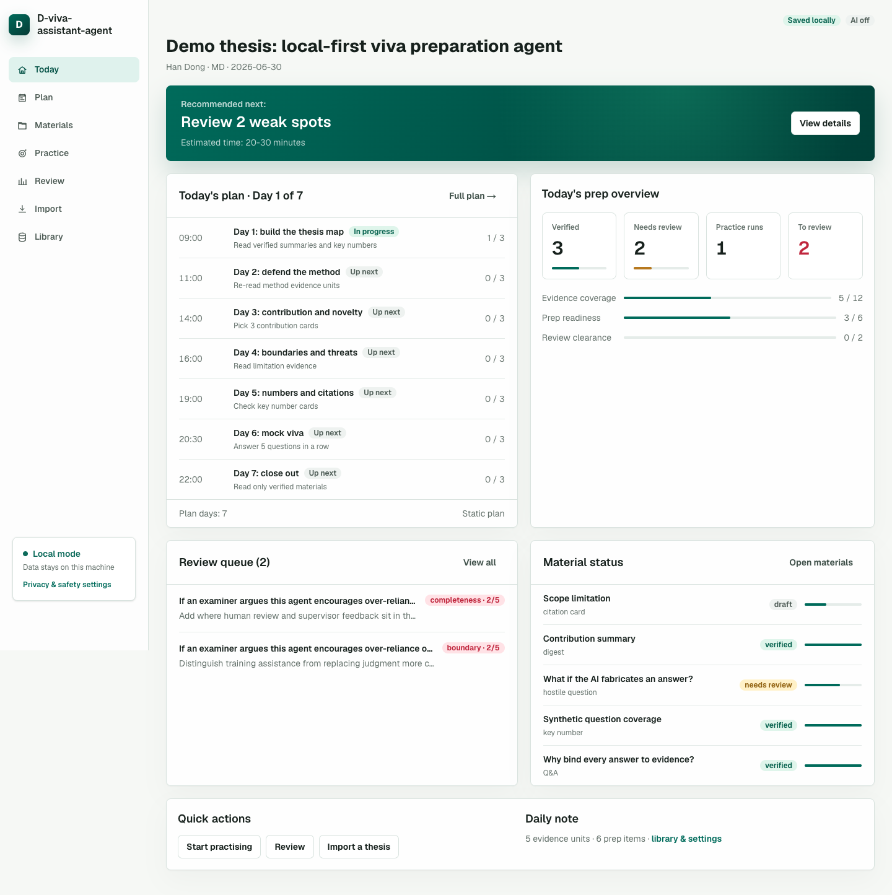
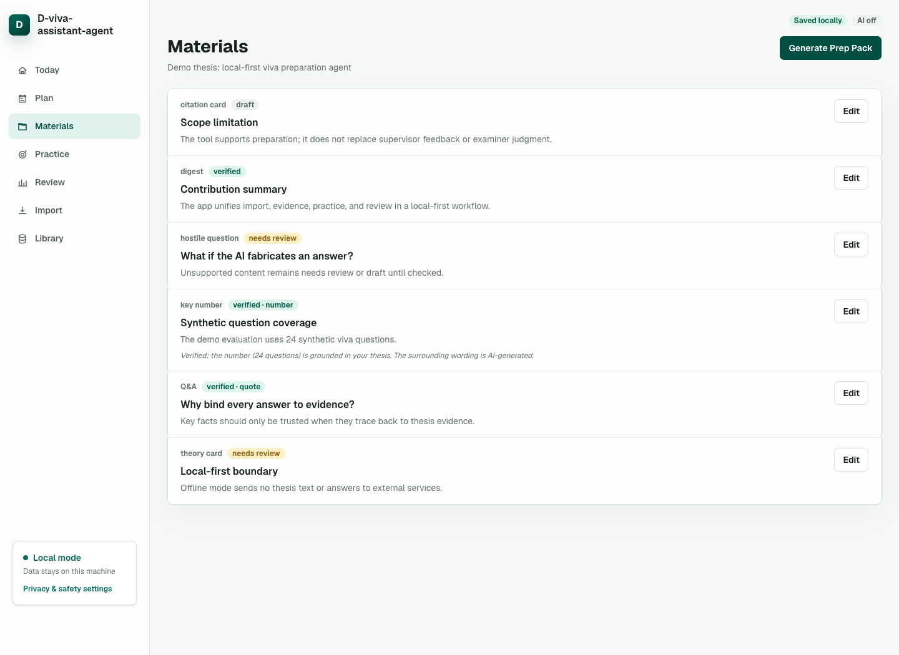
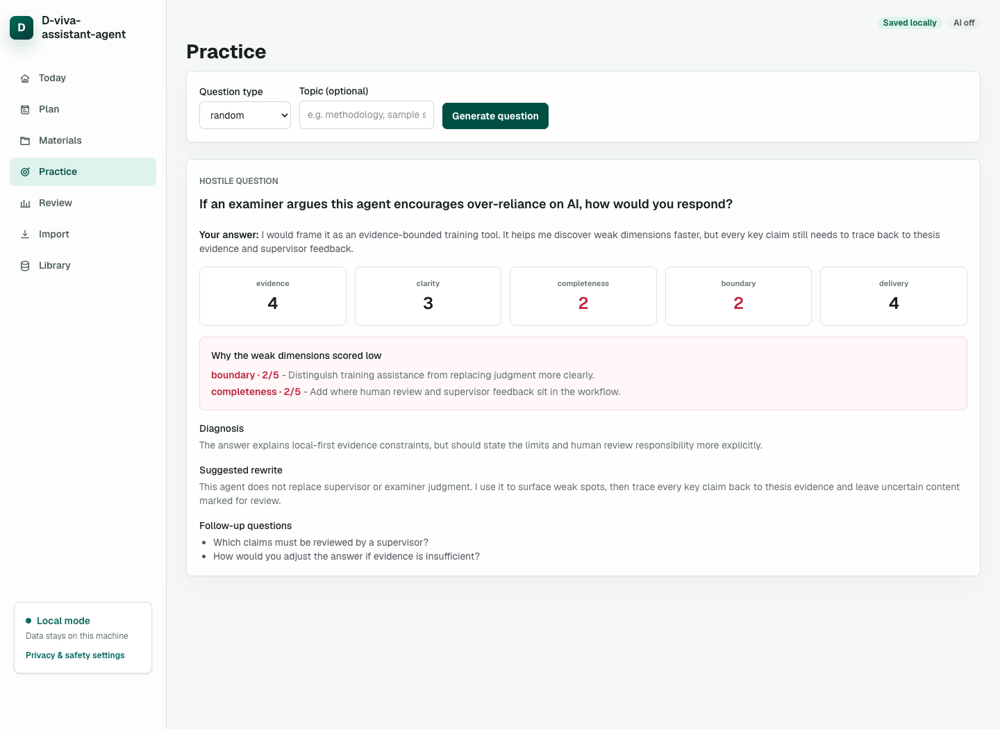
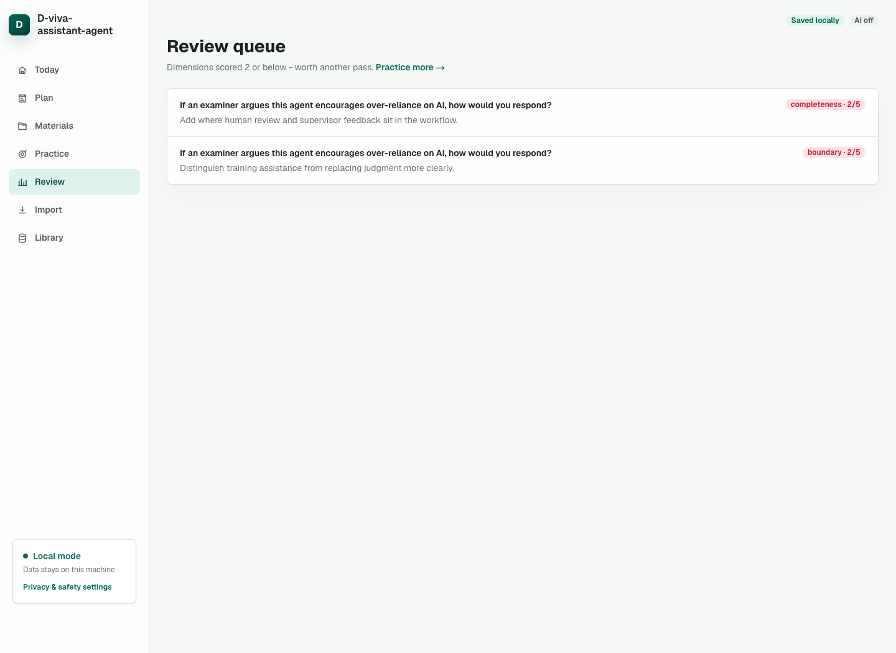
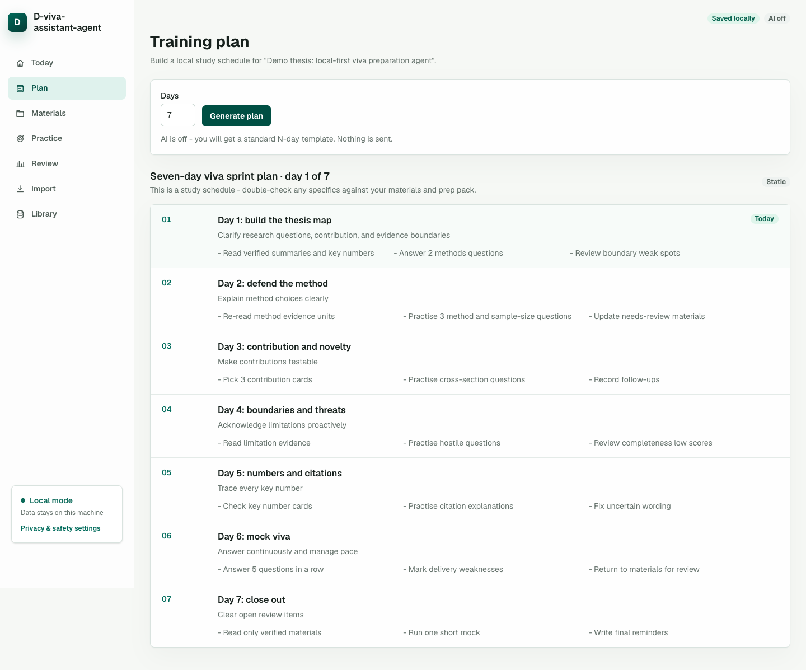
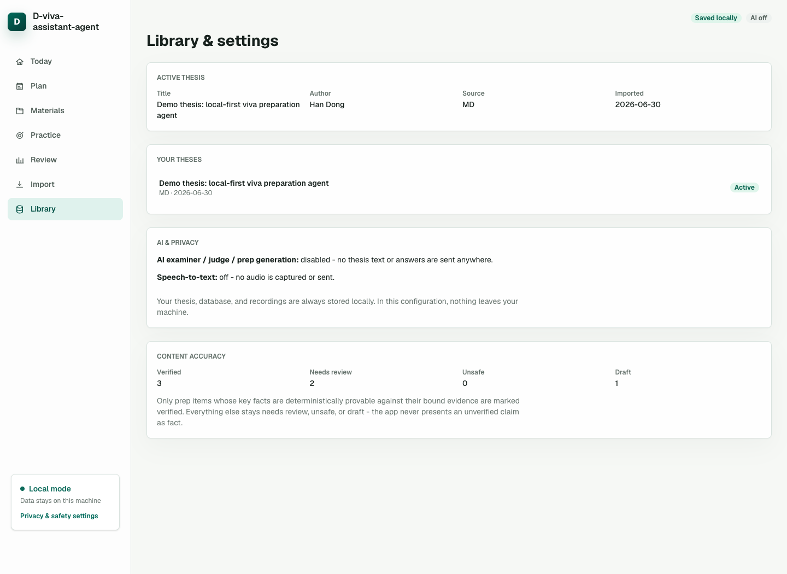

# D-viva-assistant-agent

A local-first viva preparation workspace for thesis defence.

D-viva-assistant-agent helps you turn a thesis into evidence-aware study material, practise with an AI examiner, score answers across viva-relevant dimensions, and keep a focused review queue. It is designed for candidates who want structured preparation without putting their whole thesis into a hosted web app.

Languages: English | [简体中文](README.zh-CN.md)

## Download The Latest Release

Download the latest packaged macOS app from [GitHub Releases](https://github.com/handong66/D-viva-assistant-agent/releases/latest).

New release tags are built for macOS Apple Silicon (`arm64`), Intel (`x64`), and universal macOS. Older releases may have fewer assets. The app is unsigned, so macOS may require right-clicking the app and choosing Open the first time you launch it. If you prefer to build locally, use the source setup below and run `npm run electron:pack`.

## What You Can Do

- Import a thesis from PDF, Markdown, or plain text.
- Keep a local library, dashboard, review state, and static training plan without configuring AI.
- With AI configured, build prep cards for summaries, key numbers, likely questions, hostile questions, theory cards, and citation cards.
- With AI configured, practise viva answers against questions grounded in your own thesis evidence.
- With AI configured, score answers on evidence, clarity, completeness, boundary control, and delivery.
- Review weak spots instead of rereading everything.
- Keep the default workflow local, with AI and speech-to-text enabled only when you configure them.

## Who It Is For

D-viva-assistant-agent is useful if you are:

- preparing for a PhD, MPhil, master's, or undergraduate thesis viva;
- supervising a student and want a local practice workflow;
- turning a thesis into a repeatable question-and-answer revision plan;
- checking whether claims, numbers, and quotes in prep material trace back to the thesis.

It is not a replacement for your supervisor, examiner feedback, university rules, or your own judgement.

## Typical Workflow

1. Import your thesis from PDF, Markdown, or plain text.
2. Use the dashboard and a static plan immediately, or configure AI for generated prep cards.
3. Review evidence-aware prep cards and edit anything that needs correction.
4. Practise with examiner-style questions grounded in your thesis when AI is enabled.
5. Read the score breakdown, diagnosis, rewrite suggestion, and follow-up questions.
6. Use the review queue to revisit weak evidence, boundary, completeness, clarity, or delivery points.
7. Keep a short daily plan so preparation stays focused.

## Screenshots

The screenshots below were captured from the real app running locally with a synthetic demo thesis. They do not contain private user data.

### Daily Dashboard

The dashboard shows the active thesis, recommended next action, today's plan, review queue, material status, and quick actions.



### Prep Materials

Prep cards are grouped by status, so you can separate verified facts from draft or needs-review material.



### Practice And Feedback

Generate examiner-style questions, answer them, then review scores, weak-dimension reasons, diagnosis, suggested rewrite, and follow-ups.



### Review Queue

Low-scoring dimensions are saved into a queue, making follow-up practice concrete.



### Training Plan

Use a static local plan when AI is off, or generate an AI-assisted plan after configuring a provider.



### Library, Privacy, And Accuracy

The library view shows active thesis data, AI/STT disclosure, and content accuracy counters.



## Privacy And Data

The app is local-first. Imported theses, generated material, practice runs, review items, recordings, and plans are stored on your machine by default.

Default local paths:

```text
Web/dev database: ./data/d-viva-assistant-agent.sqlite
Web/dev recordings: ./recordings
Electron database: <Electron userData>/d-viva-assistant-agent.sqlite
Electron recordings: <Electron userData>/recordings
```

For web/dev runs, set `VIVA_DB_PATH=/absolute/path/to/d-viva-assistant-agent.sqlite` in `.env.local` if you want to keep the SQLite database somewhere else. The packaged Electron app uses the app-data path shown above.

AI and speech-to-text are optional. Nothing is sent to an AI or STT provider unless you configure that provider and trigger a feature that uses it.

When AI is enabled, the app may send:

- selected thesis evidence and thesis metadata for prep generation;
- selected thesis evidence for examiner questions;
- the question, selected evidence, and your typed or transcribed answer for scoring;
- previous question and answer context for follow-up questions;
- thesis title, section names, and progress summary for AI training plans.

When Google Cloud Speech-to-Text is enabled, recorded audio is saved locally and then sent to Google for transcription. Browser speech recognition uses the browser vendor's speech stack; no app-side STT key is required.

## Accuracy Model

Generated text is not treated as fact by default. The source of truth is the thesis text you import.

- Numbers and exact quotes must appear in bound thesis evidence before they can be marked verified.
- Broader paraphrases and generated explanations remain needs review unless they can be checked deterministically.
- You should still compare important material with the thesis, supervisor notes, and official requirements.

The app is meant to make revision more evidence-aware, not to certify that an answer is academically correct.

## Quick Start

Clone the repository:

```bash
git clone https://github.com/handong66/D-viva-assistant-agent.git
cd D-viva-assistant-agent
```

Install dependencies:

```bash
npm install
```

Create a local environment file:

```bash
cp .env.example .env.local
```

Start the web app:

```bash
npm run dev
```

Open:

```text
http://localhost:3000
```

Then import a thesis from the Import page. Markdown or plain text usually gives cleaner results than a poor-quality PDF.

## Language

The UI supports English and Simplified Chinese. English is the default in `.env.example`.

To switch language, set `DVA_UI_LOCALE` in `.env.local`:

```bash
DVA_UI_LOCALE=zh-CN
# or
DVA_UI_LOCALE=en
```

Restart the app after changing the locale.

## Optional AI Setup

AI is off by default. Without AI, you can still import a thesis, store local data, view the dashboard, manage the library, keep review state, and generate a static training plan.

To enable AI-assisted prep, questions, scoring, and plans, configure:

```bash
VIVA_AI_ENABLED=true
VIVA_MODEL_DEFAULT=your-provider/your-default-model
VIVA_MODEL_HARD=your-provider/your-hard-question-model
VIVA_MODEL_FAST=your-provider/your-fast-model
AI_GATEWAY_API_KEY=your-key
```

The `VIVA_*` variable names are intentionally kept for compatibility and because viva is the thesis-defence domain term.

Use public or non-sensitive sample material when testing a new provider setup.

## Optional Speech-To-Text

Choose one mode:

```bash
STT_PROVIDER=off
STT_PROVIDER=browser
STT_PROVIDER=google_cloud
```

For Google Cloud Speech-to-Text:

```bash
GOOGLE_STT_API_KEY=your-key
```

By default, web/dev recordings go to `./recordings`; the packaged Electron app stores recordings under `<Electron userData>/recordings`. To store web/dev recordings somewhere else, set an absolute directory:

```bash
RECORDINGS_DIR=/absolute/path/to/recordings
```

Long recordings are better handled through browser speech recognition. The Google path uses synchronous recognition and is intended for short answers.

## Desktop App For macOS

For most users, the simplest option is to download the latest macOS package from [GitHub Releases](https://github.com/handong66/D-viva-assistant-agent/releases/latest).

Developers can also package unsigned local macOS apps:

```bash
npm run electron:pack
npm run electron:pack:mac:arm64
npm run electron:pack:mac:x64
npm run electron:pack:mac:universal
```

`npm run electron:pack` defaults to the current machine architecture. The explicit scripts create Apple Silicon, Intel, or universal builds under `dist-electron/`. Because the app is unsigned, macOS may require right-clicking the app and choosing Open on first launch.

Electron data is normally stored under:

```text
~/Library/Application Support/D-viva-assistant-agent/
```

Existing databases or recordings are not migrated automatically. If you are moving from an older pre-rename build, fully quit both old and new apps first.

For web/dev data, older builds may have used `./data/viva.sqlite`. Copy or rename it to `./data/d-viva-assistant-agent.sqlite`, and update `.env.local` if it still sets `VIVA_DB_PATH=./data/viva.sqlite`.

For Electron data, older builds may have used `~/Library/Application Support/viva-assistant/` or `~/Library/Application Support/Viva Assistant/`. Copy `viva.sqlite`, plus `viva.sqlite-wal` and `viva.sqlite-shm` if present, into `~/Library/Application Support/D-viva-assistant-agent/` and rename them to `d-viva-assistant-agent.sqlite`, `d-viva-assistant-agent.sqlite-wal`, and `d-viva-assistant-agent.sqlite-shm`. Copy the old `recordings/` folder too if you need old recordings. Back up files before replacing anything.

## Current Limitations

- Single-user local tool. It is not designed as a hosted multi-user service.
- No account system, cloud sync, or shared workspace permissions.
- PDF extraction quality depends on the original PDF. Use Markdown or plain text if the import looks messy.
- AI output must be checked against your thesis and academic requirements.
- The packaged macOS app is unsigned.

## For Developers

Useful checks before changing code:

```bash
npm run check
npm run build
```

Run Electron packaging checks when changing desktop behavior:

```bash
npm run electron:pack
```

Tagged releases are packaged automatically by GitHub Actions:

```bash
git tag vX.Y.Z
git push origin vX.Y.Z
```

The release workflow can also be run manually for an existing tag. It publishes macOS `arm64`, `x64`, and `universal` zip files plus `.sha256` checksums.

Do not commit secrets, private thesis data, local databases, recordings, `.env*` files, `.next/`, or `dist-electron/`.
