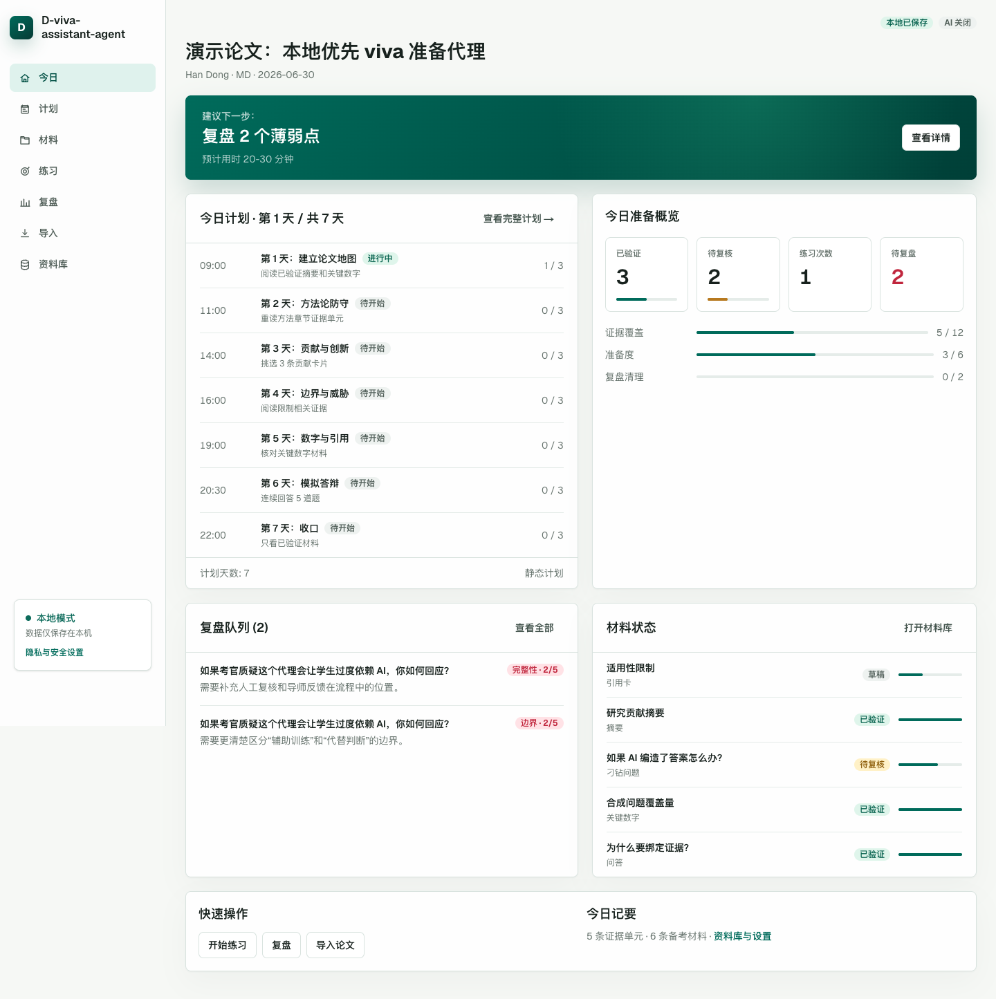
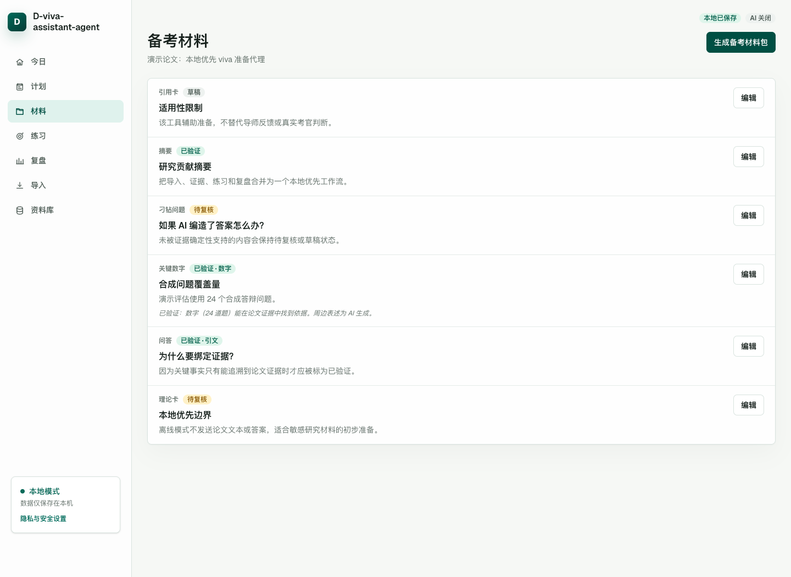
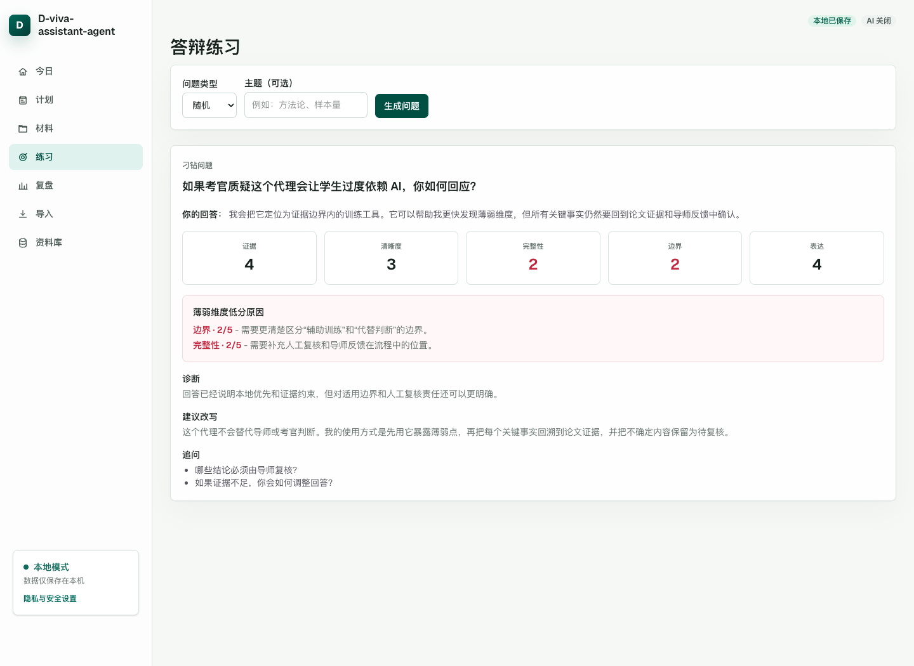
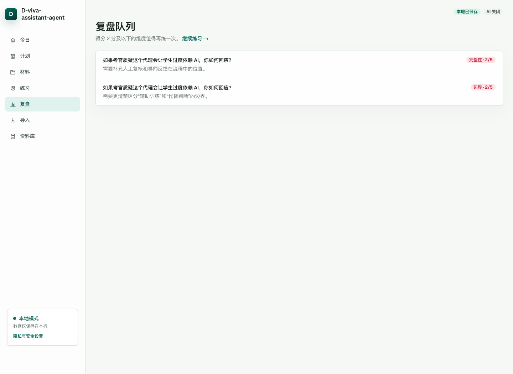
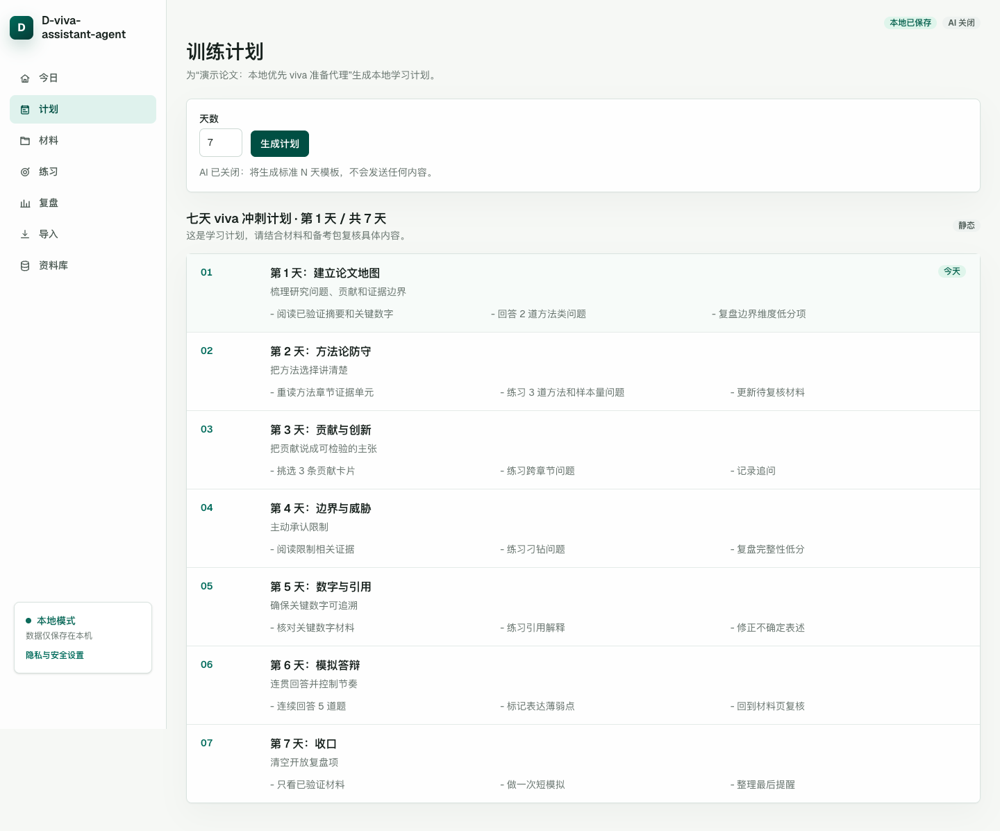
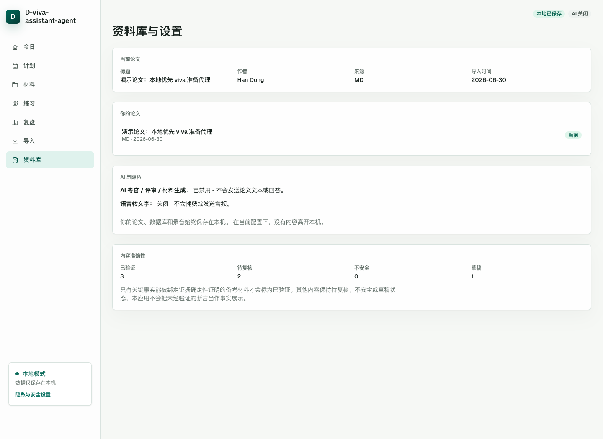

# D-viva-assistant-agent

一个本地优先的论文 viva 答辩准备工作台。

D-viva-assistant-agent 可以把论文整理成可追溯的备考材料，帮助你和 AI 考官模拟答辩，用多个维度评估回答，并把薄弱点沉淀到复盘队列。它面向希望系统备考、但又不想把整篇论文放进托管网页应用的用户。

语言：[English](README.md) | 简体中文

## 你可以用它做什么

- 从 PDF、Markdown 或纯文本导入论文。
- 不配置 AI 时，也可以使用本地资料库、首页、复盘状态和静态训练计划。
- 配置 AI 后，生成摘要、关键数字、常见问答、刁钻问题、理论卡和引用卡。
- 配置 AI 后，基于论文证据练习 viva 问答。
- 配置 AI 后，按证据、清晰度、完整性、边界控制和表达五个维度给回答评分。
- 把低分维度放入复盘队列，集中处理真正薄弱的地方。
- 默认保持本地工作流；只有在你配置并触发 AI 或语音转文字功能时，才会调用外部服务。

## 适合谁

D-viva-assistant-agent 适合：

- 正在准备 PhD、MPhil、硕士或本科毕业论文 viva 的学生；
- 希望给学生搭建本地练习流程的导师；
- 想把论文转成可重复复习的问答和训练计划的人；
- 想检查备考材料中的数字、引文和关键断言是否能追溯回论文的人。

它不能替代导师建议、考官反馈、学校要求或你自己的判断。

## 典型使用流程

1. 从 PDF、Markdown 或纯文本导入论文。
2. 先使用首页和本地静态计划；如果需要生成材料，再配置 AI。
3. 查看证据感知备考卡片，并手动修正需要调整的内容。
4. 配置 AI 后，用基于论文证据的考官式问题进行练习。
5. 查看评分拆解、诊断、建议改写和追问。
6. 用复盘队列集中处理证据、边界、完整性、清晰度或表达方面的薄弱点。
7. 保留一个简短每日计划，让备考节奏更稳定。

## 截图

以下截图来自实际本地运行的应用，使用合成演示论文数据，不包含用户私有内容。

### 今日面板

首页展示当前论文、建议下一步、今日计划、复盘队列、材料状态和快捷操作。



### 备考材料

备考卡片按状态展示，帮助你区分已验证事实、待复核材料和草稿。



### 练习与反馈

生成考官式问题，输入或转写回答，然后查看评分、低分原因、诊断、建议改写和追问。



### 复盘队列

低分维度会进入复盘队列，让后续练习更具体。



### 训练计划

AI 关闭时可以使用本地静态计划；配置 AI 后也可以生成 AI 辅助训练计划。



### 资料库、隐私与准确性

资料库页展示当前论文、AI/STT 披露和内容准确性统计。



## 隐私与数据

这个应用是本地优先的。默认情况下，导入的论文、生成的材料、练习记录、复盘项、录音和计划都保存在你的机器上。

默认本地路径：

```text
Web/开发数据库：./data/d-viva-assistant-agent.sqlite
Web/开发录音：./recordings
Electron 数据库：<Electron userData>/d-viva-assistant-agent.sqlite
Electron 录音：<Electron userData>/recordings
```

Web/开发模式下，如果想把 SQLite 数据库放在其他位置，可以在 `.env.local` 中设置 `VIVA_DB_PATH=/absolute/path/to/d-viva-assistant-agent.sqlite`。打包后的 Electron 应用使用上面列出的应用数据目录。

AI 和语音转文字都是可选功能。只有当你配置对应服务并主动触发相关功能时，才会发生外部调用。

启用 AI 后，应用可能会发送：

- 生成备考材料所需的部分论文证据和论文元数据；
- 生成考官问题所需的部分论文证据；
- 评分所需的问题、部分证据，以及你的手动回答或转写回答；
- 生成追问时需要的上一题和上一轮回答上下文；
- 生成 AI 训练计划所需的论文标题、章节名和简短进度摘要。

启用 Google Cloud Speech-to-Text 时，录音会先保存在本地，再发送给 Google 转写。浏览器语音识别使用浏览器厂商的语音能力，不需要应用侧 STT key。

## 准确性模型

生成内容默认不等于事实。事实来源始终是你导入的论文文本。

- 数字和精确引文必须出现在绑定论文证据中，才会被标记为已验证。
- 更宽泛的改写和解释如果不能确定性校验，会保持待复核状态。
- 重要材料仍然需要和论文原文、导师建议以及学校要求交叉核对。

这个应用的目标是让复习更重视证据，而不是替你证明回答一定正确。

## 快速开始

克隆仓库：

```bash
git clone https://github.com/handong66/D-viva-assistant-agent.git
cd D-viva-assistant-agent
```

安装依赖：

```bash
npm install
```

创建本地环境文件：

```bash
cp .env.example .env.local
```

启动 Web 应用：

```bash
npm run dev
```

打开：

```text
http://localhost:3000
```

然后从“导入”页面导入论文。如果 PDF 质量较差，Markdown 或纯文本通常更可靠。

## 界面语言

界面支持英文和简体中文。`.env.example` 默认使用英文。

在 `.env.local` 中设置：

```bash
DVA_UI_LOCALE=zh-CN
# 或
DVA_UI_LOCALE=en
```

修改语言后需要重启应用。

## 可选 AI 配置

AI 默认关闭。AI 关闭时，你仍然可以导入论文、保存本地数据、查看首页、管理资料库、保留复盘状态，并生成本地静态训练计划。

如果要启用 AI 辅助备考材料、考官问题、评分和训练计划，配置：

```bash
VIVA_AI_ENABLED=true
VIVA_MODEL_DEFAULT=your-provider/your-default-model
VIVA_MODEL_HARD=your-provider/your-hard-question-model
VIVA_MODEL_FAST=your-provider/your-fast-model
AI_GATEWAY_API_KEY=your-key
```

`VIVA_*` 环境变量名会保留，因为它们既用于兼容现有配置，也对应 viva 答辩这个领域词。

首次测试 provider 配置时，建议使用公开或非敏感样例内容。

## 可选语音转文字

选择一种模式：

```bash
STT_PROVIDER=off
STT_PROVIDER=browser
STT_PROVIDER=google_cloud
```

使用 Google Cloud Speech-to-Text 时：

```bash
GOOGLE_STT_API_KEY=your-key
```

默认情况下，Web/开发录音保存在 `./recordings`；打包后的 Electron 应用保存在 `<Electron userData>/recordings`。如果想把 Web/开发录音保存在其他位置，可以设置绝对路径：

```bash
RECORDINGS_DIR=/absolute/path/to/recordings
```

长录音更适合使用浏览器语音识别。Google 路径使用同步识别，更适合较短回答。

## macOS 桌面应用

可以打包一个未签名的本地 macOS 应用：

```bash
npm run electron:pack
```

生成结果位于 `dist-electron/`。由于应用未签名，第一次打开时 macOS 可能要求你右键选择 Open。

Electron 数据通常保存在：

```text
~/Library/Application Support/D-viva-assistant-agent/
```

已有数据库或录音不会自动迁移。如果从更早的改名前构建迁移，请先完全退出新旧两个应用。

Web/开发数据旧版可能使用 `./data/viva.sqlite`。可以复制或重命名为 `./data/d-viva-assistant-agent.sqlite`；如果 `.env.local` 里仍然写着 `VIVA_DB_PATH=./data/viva.sqlite`，也需要同步更新。

Electron 数据旧版可能位于 `~/Library/Application Support/viva-assistant/` 或 `~/Library/Application Support/Viva Assistant/`。把 `viva.sqlite` 以及可能存在的 `viva.sqlite-wal`、`viva.sqlite-shm` 复制到 `~/Library/Application Support/D-viva-assistant-agent/`，并分别改名为 `d-viva-assistant-agent.sqlite`、`d-viva-assistant-agent.sqlite-wal`、`d-viva-assistant-agent.sqlite-shm`。如果需要旧录音，也复制旧的 `recordings/` 文件夹。覆盖任何文件前，先备份原文件。

## 当前限制

- 这是本地单用户工具，不是托管多用户服务。
- 没有账号系统、云同步或共享工作区权限。
- PDF 抽取质量取决于原始 PDF；如果导入结果混乱，建议使用 Markdown 或纯文本。
- AI 输出必须结合论文原文和学术要求自行核对。
- 打包后的 macOS 应用未签名。

## 开发者说明

修改代码前后常用检查：

```bash
npm run check
npm run build
```

修改桌面行为时运行：

```bash
npm run electron:pack
```

不要提交 secret、私有论文数据、本地数据库、录音、`.env*` 文件、`.next/` 或 `dist-electron/`。
