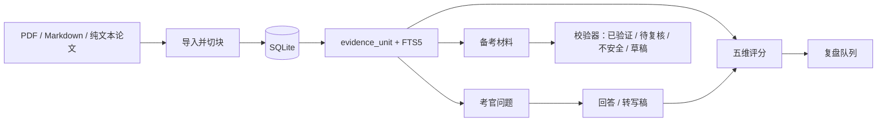

# D-viva-assistant-agent

面向任何论文的本地优先 viva 答辩准备工具。你可以导入 PDF、Markdown 或纯文本论文，把内容拆成可追溯的证据单元，生成有证据绑定的备考材料，和 AI 考官练习答辩，用五个维度评分回答，并把薄弱点沉淀到复盘队列。论文数据不会被上传到托管应用。

仓库：`handong66/D-viva-assistant-agent`

本地仓库最后验证日期：2026-06-30。

语言： [English](README.md) | 简体中文

## 为什么需要这个项目

Viva 准备通常分散在笔记、prompt、模拟问答、转写稿和考官猜测里。D-viva-assistant-agent 把这些流程放进一个本地应用：

- 导入的论文文本是唯一事实来源；
- 生成的备考材料和考官问题必须绑定本地证据单元；
- 评分拆成证据、清晰度、完整性、边界和表达五个维度；
- 薄弱维度进入复盘队列，后续练习更有针对性；
- AI 和语音转文字都是可选的外部调用，本地导入、存储、计划和复盘不依赖云端。

## 截图

以下中文截图来自实际本地运行的应用，运行时设置为 `DVA_UI_LOCALE=zh-CN`，使用合成演示论文数据，不包含用户私有内容。

### 今日面板

首页展示当前论文、建议下一步、今日计划和备考/练习/复盘统计。


### 证据感知的备考材料

备考卡片会显示 `已验证`、`待复核`、`草稿` 等状态。已验证的关键事实会展示确定性校验依据。


### AI 考官练习与评分结果

练习页展示考官问题、回答、五维评分、薄弱维度原因、诊断、建议改写和追问。


### 复盘队列

2 分及以下的维度会进入复盘队列，让后续训练聚焦具体薄弱点。


### 训练计划

AI 关闭时，应用可以保存本地静态计划；AI 配置完成后，也可以生成 AI 计划。首页会使用当前启用计划提供每日指导。


### 资料库、隐私与准确性

资料库页展示论文切换、AI/STT 隐私披露和内容准确性统计。


## 当前项目身份

- 应用/仓库展示名：`D-viva-assistant-agent`
- npm 包名：`d-viva-assistant-agent`
- Electron 产品名：`D-viva-assistant-agent`
- Electron appId：`com.handong66.dvivaassistantagent`
- 默认 Web/开发数据库：`./data/d-viva-assistant-agent.sqlite`
- 默认 Electron 数据库：`<Electron userData>/d-viva-assistant-agent.sqlite`
- GitHub 仓库：`https://github.com/handong66/D-viva-assistant-agent`

`VIVA_*` 环境变量名会暂时保留，因为它们既是兼容 API，也是 viva 答辩领域词。项目身份、包名、Electron 名称、appId 和默认数据库文件名使用新的 `D-viva-assistant-agent` 身份。

## 功能概览

- **论文导入：** 通过 `/import` 导入 PDF、Markdown 或纯文本；对质量较差的 PDF，Markdown/纯文本更可靠。
- **证据单元：** 导入文本会拆成 `thesis_chunk` 和 `evidence_unit`；证据在本地 SQLite FTS5 中建索引。
- **今日面板：** `/` 展示当前论文、建议下一步、当前训练计划日、备考计数、练习计数和复盘计数。
- **备考材料：** `/materials` 展示摘要、关键数字、问答、刁钻问题、理论卡和引用卡。
- **证据校验：** 数字和精确引文必须出现在绑定证据里，材料才能被确定性标记为 `verified`。
- **材料编辑：** `/materials/[id]/edit` 可以修改备考材料并重新校验。
- **AI 考官练习：** `/practice` 可以生成随机、跨章节、刁钻和边界问题，也可以通过 FTS 按主题检索相关证据。
- **五维评分：** 回答会按 `evidence`、`clarity`、`completeness`、`boundary` 和 `delivery` 评分。
- **复盘队列：** `/review` 存储低分维度、问题和低分原因，便于定向重练。
- **训练计划：** `/plan` 在 AI 可用时保存 AI 计划，在 AI 关闭或不可用时保存本地静态 N 天计划。
- **资料库与设置：** `/library` 切换当前论文，并展示 AI/STT 隐私披露和内容准确性统计。
- **语音转文字：** 支持手动输入、浏览器语音识别和 Google Cloud Speech-to-Text，由 `STT_PROVIDER` 控制。
- **桌面应用：** `npm run electron:pack` 会构建一个未签名的 macOS `.app`，在本地启动打包后的 Next server。

当前仍是本地单用户工具，没有账号、托管同步、多用户权限、云端持久化或生产部署脚本。

## 核心安全保证

### 证据绑定

生成内容不是事实来源。事实来源是导入论文后存入 `evidence_unit` 的文本。

- 备考材料通过 `prep_item_evidence` 绑定证据；
- 练习问题通过 `practice_run_evidence` 绑定证据；
- Judge 和 Examiner 逻辑必须使用绑定证据，而不是模型先验知识；
- 数值和精确引文必须出现在绑定证据中，确定性校验才会标记为 `verified`；
- 宽泛改写和不能确定性证明的表述保持 `needs_review`。

### 本地优先隐私边界

默认情况下，应用数据留在本机：

- SQLite 数据库：`./data/d-viva-assistant-agent.sqlite`
- 录音：`./recordings`
- Electron 数据：`<Electron userData>/d-viva-assistant-agent.sqlite` 和 `<Electron userData>/recordings`

这些内容会被 git 忽略：`.env*`、`data/`、`recordings/`、SQLite 文件和 Electron 构建输出。

只有在配置并触发对应功能时，才会发生可选外部调用：

- 生成备考包会发送论文标题和所选绑定证据；
- 生成考官问题会发送论文标题和所选绑定证据；
- 生成追问可能包含上一轮问题和回答；
- 评分会发送问题、绑定证据和回答或转写文本；
- AI 训练计划会发送论文标题、章节名和简短进度摘要；
- Google Cloud STT 会先在本地保存录音，再把音频发送到 Google Speech-to-Text；
- 浏览器语音识别使用浏览器厂商的语音能力，不需要应用侧 STT key。

### AI 降级行为

没有可用 AI 配置时，应用仍然可以导入论文、保存本地数据、展示首页/资料库状态、保存静态训练计划、保留练习和复盘状态。需要 AI 的操作会返回页面内错误，而不是让应用崩溃。

## 工作原理



## 快速开始

安装依赖：

```bash
npm install
```

创建本地环境文件：

```bash
cp .env.example .env.local
```

运行 Web 应用：

```bash
npm run dev
```

打开：

```text
http://localhost:3000
```

从 `/import` 导入论文，然后使用顶部导航：今日、计划、材料、练习、复盘、导入、资料库。

## 环境变量

重要变量：

```bash
# LLM
VIVA_AI_ENABLED=false
VIVA_MODEL_DEFAULT=
VIVA_MODEL_HARD=
VIVA_MODEL_FAST=
AI_GATEWAY_API_KEY=

# config 识别的可选 provider credentials。
# AI_GATEWAY_API_KEY 当前也会满足 provider-key 检查。
GOOGLE_GENERATIVE_AI_API_KEY=
ANTHROPIC_API_KEY=
OPENAI_API_KEY=
GOOGLE_VERTEX_PROJECT=
GOOGLE_APPLICATION_CREDENTIALS=

# Speech-to-text
STT_PROVIDER=off
GOOGLE_STT_API_KEY=

# 由 src/lib/stt/path.ts 读取；为空时默认 ./recordings。
RECORDINGS_DIR=

# UI
DVA_UI_LOCALE=zh-CN

# 只有显式 live-provider smoke test 才设为 1。
RUN_LIVE_AI=

# Tests / DB
VIVA_DB_PATH=./data/d-viva-assistant-agent.sqlite
```

AI 实际可用需要同时满足：

```text
VIVA_AI_ENABLED=true
VIVA_MODEL_DEFAULT、VIVA_MODEL_HARD、VIVA_MODEL_FAST 设置为 AI Gateway provider/model ID
AI_GATEWAY_API_KEY 存在
```

`DVA_UI_LOCALE` 控制界面语言。英文使用 `en`，简体中文使用 `zh-CN`。README 截图会使用对应语言模式分别截取。

`AI_GATEWAY_API_KEY` 当前有双重作用：它是创建 LLM client 前必须存在的 gateway key，也会满足 config 里的 provider-key 检查。`GOOGLE_VERTEX_PROJECT` 会被解析以便未来/provider 兼容，但只设置 project id 不会启用 Vertex；当前 config 只把 `GOOGLE_APPLICATION_CREDENTIALS` 计为 Vertex provider credential。

STT 模式：

- `STT_PROVIDER=off`：不显示录音按钮；
- `STT_PROVIDER=browser`：使用浏览器 Web Speech API 连续识别。根据浏览器不同，音频可能由浏览器厂商处理；
- `STT_PROVIDER=google_cloud`：使用 Google Speech-to-Text。需要 `GOOGLE_STT_API_KEY`；录音会先写到本地，再发送到 Google。

`RECORDINGS_DIR` 由 `src/lib/stt/path.ts` 解析，不由主 config parser 解析。空白或未设置时回退到 `./recordings`。

## 开发命令

标准检查：

```bash
npm run typecheck
npm run lint
npm test
npm run build
```

或运行组合检查：

```bash
npm run check
```

测试默认使用 mock LLM/STT，不会调用真实模型或语音服务。真实 AI smoke test 由 `RUN_LIVE_AI=1` 控制，并且只能使用公开样例内容。

## Electron 桌面打包

构建未签名的本地 macOS 应用：

```bash
npm run electron:pack
```

打包流程：

1. 使用 `BUILD_STANDALONE=1` 运行受控 standalone Next build；
2. 将 static/public 资源复制进 standalone 输出；
3. 重建 production `better-sqlite3`，匹配 Electron runtime；
4. 将未签名 `.app` 打包到 `dist-electron/`；
5. 将根目录 `better-sqlite3` 重建回本地 Node runtime，保证开发和测试继续可用。

第一次打开未签名 app 可能需要右键选择 Open。

桌面模式下 Electron wrapper 会设置：

```text
VIVA_DB_PATH=<Electron userData>/d-viva-assistant-agent.sqlite
RECORDINGS_DIR=<Electron userData>/recordings
```

macOS 通常位于：

```text
~/Library/Application Support/D-viva-assistant-agent/
```

旧项目身份下的本地数据不会自动迁移。

- 要保留旧 Web/开发数据，手动复制或重命名 `./data/viva.sqlite` 为 `./data/d-viva-assistant-agent.sqlite`。
- 要保留旧 Electron 数据，先完全退出旧版和新版 Electron app，再从旧 app-data 目录复制 `viva.sqlite` 以及对应的 `viva.sqlite-shm` / `viva.sqlite-wal` 到 `~/Library/Application Support/D-viva-assistant-agent/`，并分别改名为 `d-viva-assistant-agent.sqlite`、`d-viva-assistant-agent.sqlite-shm`、`d-viva-assistant-agent.sqlite-wal`。
- 如需保留旧录音，也把旧 `recordings/` 目录复制到新的 app-data 目录。
- 旧 Electron app-data 目录可能是 `~/Library/Application Support/viva-assistant/` 或 `~/Library/Application Support/Viva Assistant/`。
- 如果已有未跟踪的 `.env.local` 显式设置 `VIVA_DB_PATH=./data/viva.sqlite`，需要手动更新，否则仍会使用旧开发数据库路径。

不要提交 `dist-electron/`、`.next/`、本地数据库、录音或环境文件。

## 技术栈

- Next.js App Router、React、TypeScript
- Server Actions：导入、备考生成、计划生成、练习、评分、录音转写、当前论文切换
- Tailwind CSS
- `better-sqlite3` 本地持久化
- `unpdf` PDF 文本抽取
- AI SDK `generateText`，通过统一 `lib/llm` 层输出结构化对象
- Zod 环境变量和 LLM 输出校验
- Vitest 单元/集成测试
- Electron + electron-builder 本地 macOS 打包

## 仓库结构

```text
src/app/                    Next.js 路由和 Server Actions
src/app/import/             论文导入界面
src/app/materials/          备考材料列表、生成按钮、编辑页
src/app/plan/               训练计划界面
src/app/practice/           考官问题和回答流程
src/app/review/             低分维度复盘队列
src/app/library/            论文切换、隐私披露、准确性统计
src/db/                     SQLite client、迁移、repository 函数和测试
src/lib/config.ts           环境变量解析和功能开关
src/lib/ui-copy.ts          英文和简体中文 UI 文案
src/lib/ingest/             PDF/Markdown/纯文本抽取和切块
src/lib/evidence/           确定性备考材料校验器
src/lib/llm/                模型注册、client、transport、prompts、mock client
src/lib/stt/                STT 模式解析、Google transport、录音路径
src/lib/plan.ts             静态计划 helper 和日期计算
electron/main.cjs           启动打包后 Next server 的 Electron wrapper
scripts/pack-electron.mjs   macOS 打包流程
docs/assets/screenshots/en/ 英文 README 截图，来自合成演示论文
docs/assets/screenshots/zh-CN/ 中文 README 截图，来自合成演示论文
docs/superpowers/specs/     产品和架构 spec
docs/superpowers/plans/     里程碑和功能 gate 实施计划
```

## 数据模型

Schema 定义在 `src/db/migrations/` 的 TypeScript 字符串迁移中。

核心表：

- `thesis`：导入的论文和当前激活论文；
- `thesis_chunk`：按阅读顺序保存的文本块；
- `evidence_unit`：从文本块派生的证据单元；
- `evidence_fts`：证据文本的 FTS5 索引；
- `generation_run`：AI 生成任务记录；
- `prep_item` 与 `prep_item_evidence`：备考卡片及其绑定证据；
- `practice_run` 与 `practice_run_evidence`：考官问题、回答、评分和绑定证据；
- `review_item`：低分维度复盘队列；
- `recording`：本地录音文件和转写状态；
- `plan` 与 `plan_day`：保存的训练计划；
- `ai_call_log`：不含 secret 的模型调用 telemetry。

## 文档地图

- `AGENTS.md`：冷启动契约和不可破坏的项目守则；
- `docs/PROJECT_STATUS.md`：当前项目状态快照；
- `docs/superpowers/specs/2026-06-23-D-viva-assistant-agent-generic-design.md`：产品和架构 spec；
- `docs/superpowers/plans/*.md`：里程碑和功能 gate 实施计划。

修改数据模型、环境变量契约、AI/STT 行为、证据保证、桌面打包或用户可见流程时，应同步更新相关文档。

## 已知限制

- 这是本地开发工具，不是托管 SaaS；
- AI 备考包、考官和评分功能需要 AI Gateway 和模型环境变量；
- Google Cloud STT 使用同步 `speech:recognize`，长录音建议使用浏览器语音识别；
- PDF 抽取质量取决于原始 PDF；质量差时建议粘贴 Markdown 或纯文本；
- Electron 构建目前聚焦 macOS，且未签名；
- 仓库不提交样例论文 fixture；README 截图来自文档工作中生成的合成本地演示数据库。

## 贡献纪律

声称修改完成前，运行：

```bash
npm run check
npm run build
```

修改桌面 wrapper 或打包流程时，运行：

```bash
npm run electron:pack
```

不要提交 secret、本地论文数据、数据库、录音、构建输出或任何用户私有论文内容。
